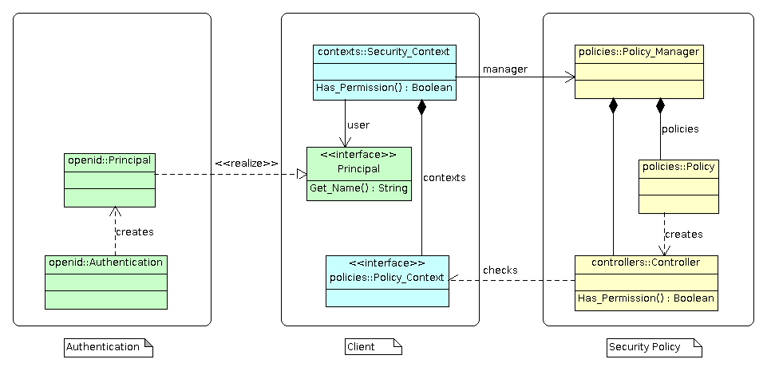

# Security
The `Security` package provides a security framework that allows
an application to use OpenID or OAuth security frameworks.  This security
framework was first developed within the [Ada Server Faces](https://github.com/stcarrez/ada-asf) project.
It was moved to a separate project so that it can easily be used with [AWS](https://github.com/AdaCore/aws).
This package defines abstractions that are close or similar to Java
security package.

The security framework uses the following abstractions:

* **Policy and policy manager**:
  The `Policy` defines and implements the set of security rules that specify how to
  protect the system or resources.  The `Policy_Manager` maintains the security policies.

* **Principal**:
  The `Principal` is the entity that can be authenticated.  A principal is obtained
  after successful authentication of a user or of a system through an authorization process.
  The OpenID or OAuth authentication processes generate such security principal.

* **Permission**:
  The `Permission` represents an access to a system or application resource.
  A permission is checked by using the security policy manager.  The policy manager uses a
  security controller to enforce the permission.

The `Security_Context` holds the contextual information that the security controller
can use to verify the permission.  The security context is associated with a principal and
a set of policy context.

## Overview
An application will create a security policy manager and register one or several security
policies (yellow).  The framework defines a simple role based security policy and an URL
security policy intended to provide security in web applications.  The security policy manager
reads some security policy configuration file which allows the security policies to configure
and create the security controllers.  These controllers will enforce the security according
to the application security rules.  All these components are built only once when
an application starts.

A user is authenticated through an authentication system which creates a `Principal`
instance that identifies the user (green).  The security framework provides two authentication
systems: OpenID and OAuth 2.0 OpenID Connect.



When a permission must be enforced, a security context is created and linked to the
`Principal` instance (blue).  Additional security policy context can be added depending
on the application context.  To check the permission, the security policy manager is called
and it will ask a security controller to verify the permission.

The framework allows an application to plug its own security policy, its own policy context,
its own principal and authentication mechanism.

## Permission
The <b>Security.Permissions</b> package defines the different permissions that can be
checked by the access control manager.  An application should declare each permission
by instantiating the <tt>Definition</tt> package:

```Ada
package Perm_Create_Workspace is new Security.Permissions.Definition ("create-workspace");
```

This declares a permission that can be represented by "<tt>create-workspace</tt>" in
configuration files.  In Ada, the permission is used as follows:

```Ada
 Perm_Create_Workspace.Permission
```

## Principal
A principal is created by using either the [Security_Auth OpenID],
the [Security_OAuth OAuth] or another authentication mechanism.  The authentication produces
an object that must implement the `Principal` interface.  For example:

```Ada
P : Security.Auth.Principal_Access := Security.Auth.Create_Principal (Auth);
```

or

```Ada
P : Security.OAuth.Clients.Access_Token_Access := Security.OAuth.Clients.Create_Access_Token
```

The principal is then stored in a security context.

## Security Context
The security context provides contextual information for a security controller to
verify that a permission is granted.
This security context is used as follows:

  * An instance of the security context is declared within a function/procedure as
  a local variable.  This instance will be associated internally with the current thread
  through a task attribute.
  * The security context is populated with information to identify the current user,
  his roles, permissions and other information that could be used by security controllers.
  * To verify a permission, the current security context is retrieved and the
  <b>Has_Permission</b> operation is called.  This operation will use the security manager
  to find the security controller associated with the permission to verify.
  * The security controller will be called with the security context to check the permission.
  The whole job of checking the permission is done by the security controller or its
  associated policy manager.  The security controller retrieves information from the
  security context to decide whether the permission is granted or not.

For example the security context is declared as follows:

```Ada
Context : Security.Contexts.Security_Context;
```

A security policy and a principal must be set in the security context.  The security policy
defines the rules that govern the security and the principal identifies the current user.

```Ada
Context.Set_Context (Policy_Manager, P);
```

A permission is checked by using the <tt>Has_Permission</tt> operation:

```Ada
if Security.Contexts.Has_Permission (Perm_Create_Workspace.Permission) then
  -- Granted
else
  -- Denied
end if;
```


