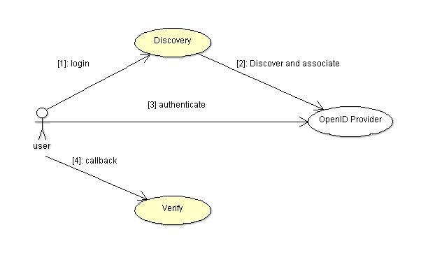

# Authentication
The `Security.Auth` package implements an authentication framework that is
suitable for OpenID 2.0, OAuth 2.0 and later for OpenID Connect.  It allows an application
to authenticate users using an external authorization server such as Google, Facebook,
Google +, Twitter and others.

See [OpenID Authentication 2.0](https://openid.net/specs/openid-authentication-2_0.html) - Final
https://openid.net/specs/openid-authentication-2_0.html

See [OpenID Connect Core 1.0](https://openid.net/specs/openid-connect-core-1_0.html)
https://openid.net/specs/openid-connect-core-1_0.html

See Facebook API: The Login Flow for Web (without JavaScript SDK)
https://developers.facebook.com/docs/facebook-login/login-flow-for-web-no-jssdk/

Despite their subtle differences, all these authentication frameworks share almost
a common flow.  The API provided by `Security.Auth` defines an abstraction suitable
for all these frameworks.

There are basically two steps that an application must implement:

  * `Discovery`: to resolve and use the OpenID provider and redirect the user to the
  provider authentication form.
  * `Verify`: to decode the authentication and check its result.



The authentication process is the following:

  * The application should redirect the user to the authentication URL.
  * The OpenID provider authenticate the user and redirects the user to the callback CB.
  * The association is decoded from the callback parameter.
  * The `Verify` procedure is called with the association to check the result and
  obtain the authentication results.

## Initialization
The initialization process must be done before each two steps (discovery and verify).
The Authentication manager must be declared and configured.

```Ada
Mgr   : Security.Auth.Manager;
```

For the configuration, the <b>Initialize</b> procedure is called to configure
the Auth realm and set the authentication return callback URL.  The return callback
must be a valid URL that is based on the realm.  Example:

```Ada
Mgr.Initialize (Name      => "http://app.site.com/auth",
                Return_To => "http://app.site.com/auth/verify",
                Realm     => "openid");
```

After this initialization, the authentication manager can be used in the authentication
process.

## OpenID Configuration
The Open ID provider needs the following configuration parameters:

```Ada
openid.realm          The OpenID realm parameter passed in the authentication URL.
openid.callback_url   The OpenID return_to parameter.
```

### Google+
The Google+ authentication is based on OAuth 2.0 and the OpenID Connect Basic Client Profile.

See https://developers.google.com/accounts/docs/OAuth2Login

## Discovery: creating the authentication URL
The first step is to create an authentication URL to which the user must be redirected.
In this step, we have to create an OpenID manager, discover the OpenID provider,
do the association and get an <b>End_Point</b>.  The OpenID provider is specified as an
URL, below is an example for Google OpenID:

```Ada
Provider : constant String := "https://www.google.com/accounts/o8/id";
OP       : Security.Auth.End_Point;
Assoc    : constant Security.Auth.Association_Access := new Security.Auth.Association;
```

The following steps are performed:

  * The <b>Discover</b> procedure is called to retrieve from the OpenID provider the XRDS
  stream and identify the provider.  An <b>End_Point</b> is returned in <tt>OP</tt>.
  * The <b>Associate</b> procedure is called to make the association with the <b>End_Point</b>.
  The <b>Association</b> record holds session, and authentication.

```Ada
Mgr.Discover (Provider, OP);  --  Yadis discovery (get the XRDS file).
Mgr.Associate (OP, Assoc.all);--  Associate and get an end-point with a key.
```

After this first step, you must manage to save the association in the HTTP session.
Then you must redirect to the authentication URL that is obtained by using:

```Ada
Auth_URL : constant String := Mgr.Get_Authentication_URL (OP, Assoc.all);
```

## Verify: acknowledge the authentication in the callback URL
The second step is done when the user has finished the authentication successfully or not.
For this step, the application must get back the association that was saved in the session.
It must also prepare a parameters object that allows the OpenID framework to get the
URI parameters from the return callback.

```Ada
Assoc      : Association_Access := ...;  --  Get the association saved in the session.
Credential : Security.Auth.Authentication;
Params     : Auth_Params;
```

The auth manager must be initialized and the <b>Verify</b> procedure is called with
the association, parameters and the authentication result.  The <b>Get_Status</b> function
must be used to check that the authentication succeeded.

```Ada
Mgr.Verify (Assoc.all, Params, Credential);
if Security.Auth.Get_Status (Credential) = Security.Auth.AUTHENTICATED then ...  -- Success.
```

## Principal creation
After the user is successfully authenticated, a user principal can be created and saved in
the session.  The user principal can then be used to assign permissions to that user and
enforce the application permissions using the security policy manger.

```Ada
P : Security.Auth.Principal_Access := Security.Auth.Create_Principal (Credential);
```

