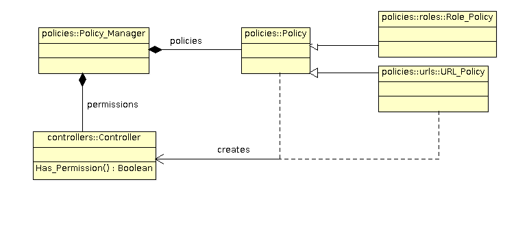

# Security Policies
The Security Policy defines and implements the set of security rules that specify
how to protect the system or resources. The `Policy_Manager` maintains
the security policies.  These policies are registered when an application starts,
before reading the policy configuration files.



While the policy configuration files are processed, the policy instances that have been
registered will create a security controller and bind it to a given permission.  After
successful initialization, the `Policy_Manager` contains a list of securiy
controllers which are associated with each permission defined by the application.

## Authenticated Permission
The `auth-permission` is a pre-defined permission that can be configured in the XML
configuration.  Basically the permission is granted if the security context has a principal.
Otherwise the permission is denied.  The permission is assigned a name and is declared
as follows:

```Ada
  <policy-rules>
    <auth-permission>
      <name>view-profile</name>
    </auth-permission>
  </policy-rules>
```

This example defines the `view-profile` permission.

## Grant Permission
The `grant-permission` is another pre-defined permission that gives the permission whatever
the security context.  The permission is defined as follows:

```Ada
  <policy-rules>
    <grant-permission>
      <name>anonymous</name>
    </grant-permission>
  </policy-rules>
```

This example defines the `anonymous` permission.

## Role Based Security Policy
The `Security.Policies.Roles` package implements a role based security policy.
In this policy, users are assigned one or several roles and permissions are
associated with roles.  A permission is granted if the user has one of the roles required
by the permission.

### Policy creation
An instance of the `Role_Policy` must be created and registered in the policy manager.
Get or declare the following variables:

```Ada
  Manager : Security.Policies.Policy_Manager;
  Policy  : Security.Policies.Roles.Role_Policy_Access;
```

Create the role policy and register it in the policy manager as follows:

```Ada
  Policy := new Role_Policy;
  Manager.Add_Policy (Policy.all'Access);
```

### Policy Configuration
A role is represented by a name in security configuration files.  A role based permission
is associated with a list of roles.  The permission is granted if the user has one of these
roles.  When the role based policy is registered in the policy manager, the following
XML configuration is used:

```Ada
  <policy-rules>
    <security-role>
      <role-name>admin</role-name>
    </security-role>
    <security-role>
      <role-name>manager</role-name>
    </security-role>
    <role-permission>
      <name>create-workspace</name>
      <role>admin</role>
      <role>manager</role>
    </role-permission>
    ...
  </policy-rules>
```

This definition declares two roles: `admin` and `manager`
It defines a permission `create-workspace` that will be granted if the
user has either the `admin` or the `manager` role.

Each role is identified by a name in the configuration file.  It is represented by
a `Role_Type`.  To provide an efficient implementation, the `Role_Type`
is represented as an integer with a limit of 64 different roles.

### Assigning roles to users
A `Security_Context` must be associated with a set of roles before checking the
permission.  This is done by using the `Set_Role_Context` operation:

```Ada
   Security.Policies.Roles.Set_Role_Context (Security.Contexts.Current, "admin");
```

## URL Security Policy
The `Security.Policies.Urls` implements a security policy intended to be used
in web servers.  It allows to protect an URL by defining permissions that must be granted
for a user to get access to the URL.  A typical example is a web server that has a set of
administration pages, these pages should be accessed by users having some admin permission.

### Policy creation
An instance of the `URL_Policy` must be created and registered in the policy manager.
Get or declare the following variables:

```Ada
  Manager : Security.Policies.Policy_Manager;
  Policy  : Security.Policies.Urls.URL_Policy_Access;
```

Create the URL policy and register it in the policy manager as follows:

```Ada
  Policy := new URL_Policy;
  Manager.Add_Policy (Policy.all'Access);
```

### Policy Configuration
Once the URL policy is registered, the policy manager can read and process the following
XML configuration:

```Ada
  <policy-rules>
    <url-policy id='1'>
      <permission>create-workspace</permission>
      <permission>admin</permission>
      <url-pattern>/workspace/create</url-pattern>
      <url-pattern>/workspace/setup/*</url-pattern>
    </url-policy>
    ...
  </policy-rules>
```

This policy gives access to the URL that match one of the URL pattern if the
security context has the permission `create-workspace` or `admin`.
These two permissions are checked according to another security policy.
The XML configuration can define several `url-policy`.  They are checked in
the order defined in the XML.  In other words, the first `url-policy` that matches
the URL is used to verify the permission.

The `url-policy` definition can contain several `permission`.
The first permission that is granted gives access to the URL.

### Checking for permission
To check a URL permission, you must declare a `URL_Permission` object with the URL.

```Ada
   URL    : constant String := ...;
   Perm   : constant Policies.URLs.URL_Permission (URL'Length)
             := URL_Permission '(Len => URI'Length, URL => URL);
```

Then, we can check the permission:

```Ada
   Result : Boolean := Security.Contexts.Has_Permission (Perm);
```


